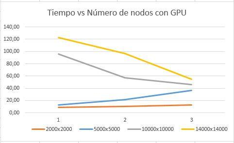

# PARCIAL 1 - HIGH PERFORMANCE COMPUTING

Se realizó la implementación utilizando  ```MPI​ y CUDA``` para la multiplicación de matrices. Las dimensiones con las que trabajamos fueron para  ```A(NxN) y B(NxN) ``` Las siguientes tablas muestran los tiempos de ejecución del algoritmo  al ser ejecutado con diferente número de nodos.


## Tiempos de la primera multiplicacion de matrices

### Dimensiones

Matrices  ```2000 x 2000```         

### tiempo en segundos

| Nodos   |   CPU      |    GPU      |
|---------|------------|-------------|
|	1     |   74.07261 | 9.012321    |
|	2	  |  89.543682 | 10.563445   |
|	3	  | 114.836383 | 12.474576   |


##segunda multiplicación

### Dimensiones

Matrices  ```5000 x 5000```         

### tiempo en segundos

| Nodos   |   CPU      |    GPU       |
|---------|------------|--------------|
|	1     | 327.624736  |  12.474576s |
|	2	  | 297.123162  |	21.211148 |
|	3	  | 245.000006s |	36.262714 |


##tercera multiplicación

###Dimenciones

Matrices  ```10000 x 10000```         

### tiempo en segundos

|ejecucion|   CPU   |    GPU      |
|---------|---------|-------------|
|	1     |         |  95.871263  |
|	2	  |         |  56.756788   |
|	3	  |         |  45.875401 |


## Tiempos de la cuarta multiplicacion de matrices

### Dimensiones

Matrices  ```14000 x 14000```          

### tiempo en segundos

|Nodos    |   CPU   |      GPU      |
|---------|---------|---------------|
|	1     |         |	123.002015  |
|	2	  |         |	97.000757   |
|	3	  |         |	55.000755   |


## Grafica de tiempos




## Conclusiones

*En esta práctica se pudo observar que al multiplicar las matrices de menor tamaño, para este caso 2000x2000, ambos algoritmos aumentaron su tiempo de ejecución al aumentar el numero de nodos; esto se debe al cuello de botella que se maneja enviar los mensajes con el uso de MPI.
A medida de que aumenta el tamaño de las matrices y al sacar provecho de las GPU, se logra disminuir los tiempos de ejecución como se esperaba al aumentar la cantidad de nodos. Al comparar el tiempo de respuesta de la multiplicación 10000X10000 desde un nodo, se logró un aumento de desempeño del 42 porciento aproximadamente al incrementar el numero de nodos a 2. Del mismo modo, al ejecutar el algoritmo con uso de GPU y tamaño de 14000x14000 se obtuvo un aumento en el desempeño del 21 % y 55 % al aumentar el número de nodos a 2 y 3 respectivamente.

Probando con diferentes número de nodos se aumenta el paralelismo y por ende se vio un incremento en el desempeño del algoritmo.

***
###### CRISTIAN CAMILO SALAZAR SALAZAR
###### WILLIAM ENRIQUE CHOQUE VALDERRAMA
