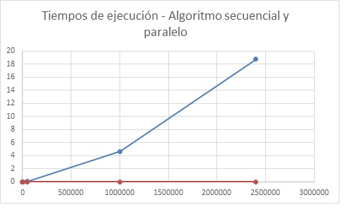

# PARCIAL 1 - HIGH PERFORMANCE COMPUTING

Se realizó la implementación en ```CUDA c``` para la multiplicación de matrices  de diferentes dimensiones, las dimensiones con las que trabajamos fueron para la matriz  ```A(MxN) y B(NxY) ``` Las siguientes tablas muestran los tiempos de 5 ejecuciones de cada algoritmo para cada multiplicación con su respectivo promedio y la aceleración obtenida por el algoritmo paralelo en


## Tiempos de la primera multiplicacion de matrices


### Dimensiones

Matrices  ```5x7 *7x3```             tiled Width ```= 1```

### tiempo en segundos

|ejecucion|   CPU   |    GPU    |
|---------|---------|-----------|
|	1     |0.000006s  |	0,000059  |
|	2	  |0.000006s  |	0,000059  |
|	3	  |0.000006s  |	0,000006  |
|	4	  |0.000006s  |	0,000059  |
|	5	  |0.000006s  |	0,000059  |


### promedio

|CPU     | GPU       |
|--------|-----------|
|0,000006|	0,000059|

## Tiempos de la segunda multiplicacion de matrices

### Dimensiones

Matrices  ```50x60 *60x65```          tiled Width  ```32```

### tiempo en segundos

|ejecucion|   CPU   |    GPU    |
|---------|---------|-----------|
|	1     |0.000809s |	0.000755s  |
|	2	  |0.00081s |	0.000757s  |
|	3	  |0.00081s  |	0.000755s  |
|	4	  |0.00081s |	0.000756s  |
|	5	  |0.000812s  |	0,000059  |


### promedio

|CPU     | GPU       |
|--------|-----------|
|0.0008102|	0.0007565|


##Tercera multiplicación

###Dimenciones

Matrices  ```200x210 *210x200```         tiled Width   ```32```

### tiempo en segundos

|ejecucion|   CPU   |    GPU    |
|---------|---------|-----------|
|	1     |0.034532s |	0.000161s  |
|	2	  |0.034621s |	0.000166s  |
|	3	  |0.034529s  |	0.000755s  |
|	4	  |0.034529s |	0.00016s  |
|	5	  |0.034518s  |	0.00016s  |


### promedio

|CPU     | GPU       |
|--------|-----------|
|0.0345458|	0.0002804|


##Cuarta multiplicación

###Dimenciones

Matrices  ```1000x1001 *1001x1010```         tiled Width   32

### tiempo en segundos

|ejecucion|   CPU   |    GPU    |
|---------|---------|-----------|
|	1     |5.83502s |	0.002342s  |
|	2	  |4.3057s |	0.002354s  |
|	3	  |4.28207s  |	0.002327s  |
|	4	  |4.29267s |	0.002669s  |
|	5	  |4.3348s  |	0.002372s  |


### promedio

|CPU     | GPU       |
|--------|-----------|
|4.610052|	0.0019442|


##Quinta multiplicación

###Dimenciones

Matrices  ```1500x1550 *1550x1506```       tiled Width   32

### tiempo en segundos

|ejecucion|   CPU   |    GPU    |
|---------|---------|-----------|
|	1     |18.5835s |	0.006309s  |
|	2	  |18.6572s |	0.006117s  |
|	3	  |19.5045s  |	0.006464s  |
|	4	  |18.5485 |	0.006215s  |
|	5	  |18.741s  |	0.006437s  |


### promedio

|CPU     | GPU       |
|--------|-----------|
|18.75294|	0.0063084|

## Grafica de tiempos




## Conclusiones

*En esta práctica se pude observar que al multiplicar matrices pequeñas ambos algoritmos tienen un desempeño en tiempo muy similar, se nota que es un poco más rápido el algoritmo secuencial por el “cuello de botella” que es generado al enviar los datos hacia el device y esperar su resultado. 
A medida que se aumentaba el tamaño de las matrices a multiplicar, se puede apreciar el desempeño del proceso en paralelo. Con las matrices de ```50x60``` ```*60x65```  a pesar de ser de pequeñas dimensiones se nota un aumento de desempeño en el paralelo, en cambio con matrices de 1000x1001 ```*1001x1010```, donde se aprecia un aumento de tamaño considerable, el paralelo aumentó el desempeño al secuencial con ```1827.49X``` .
Al probar con diferentes tamaños de tiles se aumenta el paralelismo y por ende se vio un incremento en el desempeño del algoritmo.

***
###### CRISTIAN CAMILO SALAZAR SALAZAR
###### WILLIAM ENRIQUE CHOQUE
